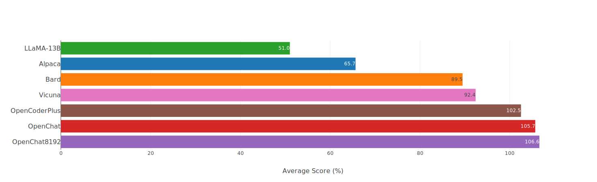
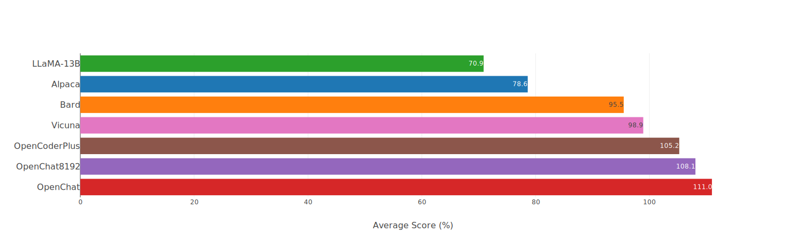
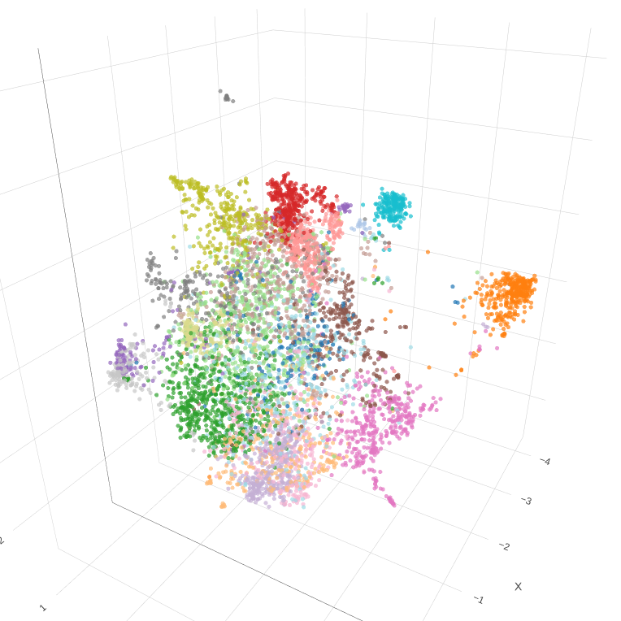

# OpenChat: Less is More for Open-source Models

OpenChat is a series of open-source language models fine-tuned on a diverse and high-quality dataset of multi-round conversations. With only ~6K GPT-4 conversations filtered from the ~90K ShareGPT conversations, OpenChat is designed to achieve high performance with limited data.

**🔥 80.9% [AlpacaEval](https://tatsu-lab.github.io/alpaca_eval/) win-rate, rank #1 of open-source models**

**🚀 105.7% ChatGPT performance (Vicuna GPT-4 eval)**

**🤗 Using only 6K data**

## News

- [2023/07] We released the OpenChat model series, with **105%** ChatGPT performance (Vicuna GPT-4 evaluation)

## Models

#### Generic Models:

 - **OpenChat**: based on LLaMA-13B with a context length of 2048.
   - Achieves **105.7%** of ChatGPT score on the Vicuna GPT-4 evaluation.
   - Achieves a **80.9%** win-rate on AlpacaEval.
 - **OpenChat-8192**: based on LLaMA-13B, with an extended context length of 8192.
   - Achieves **106.6%** of ChatGPT score on the Vicuna GPT-4 evaluation.
   - Achieves a **79.5%** win-rate on AlpacaEval.

#### Code Models:

 - **OpenCoderPlus**: based on StarCoderPlus with a native context length of 8192.
   - Achieves **102.5%** of ChatGPT score on the Vicuna GPT-4 evaluation.
   - Achieves a **78.7%** win-rate on AlpacaEval.

**Model Evaluation**

We have evaluated our models using the Vicuna GPT-4 and AlpacaEval benchmarks. The evaluation results are presented in the following figures.

**Vicuna GPT-4 Evalutaion (v.s. gpt-3.5-turbo)**



**Vicuna GPT-3.5-Turbo Evalutaion (v.s. gpt-3.5-turbo)**



Note that our evaluation schema slightly differs from Vicuna. Following [Wang et. al, 2023](https://arxiv.org/pdf/2305.17926.pdf), we additionally adopted evidence calibration (EC) + balanced position calibration (BPC) to reduce potential bias.

### AlpacaEval

|                       | **Win Rate** | **Std Error** |
|-----------------------|--------------|---------------|
| gpt4                  | 95.3         | 0.7           |
| claude                | 88.4         | 1.1           |
| chatgpt               | 86.1         | 1.2           |
| **openchat-13b**      | **80.9**     | 1.4           |
| **openchat8192-13b**  | **79.5**     | 1.4           |
| **opencoderplus-15b** | **78.7**     | 1.4           |
| wizardlm-13b          | 75.3         | 1.5           |
| guanaco-65b           | 71.8         | 1.6           |
| vicuna-13b            | 70.4         | 1.6           |
| oasst-rlhf-llama-33b  | 66.5         | 1.7           |
| text_davinci_003      | 50.0         | 0.0           |
| falcon-40b-instruct   | 45.7         | 1.8           |
| alpaca-farm-ppo-human | 41.2         | 1.7           |
| alpaca-7b             | 26.5         | 1.5           |
| text_davinci_001      | 15.2         | 1.2           |

## Standard benchmarks

(Working in progress ...)

| Models                                                                          | LLaMA-13B BFloat16 | OpenChat  | OpenChat8192 |
|---------------------------------------------------------------------------------|--------------------|-----------|--------------|
| MMLU [(chain-of-thought hub)](https://github.com/FranxYao/chain-of-thought-hub) | 46.66              | **48.53** | 45.16        |

## Installation

To use OpenChat, you need to have CUDA and PyTorch installed. You can clone this repository and install the dependencies via pip:

```bash
git clone git@github.com:imoneoi/OChat.git
```

```bash
pip install -r requirements.txt
```

## Weights & Serving

We provide full weights of all models as huggingface repos. You can use the following commands to start a local API server at `http://localhost:18888`. Please note that models should be used under their foundation models' license.

| Model         | Size | Context | Weights                                                                 | Serve                                                                                                      |
|---------------|------|---------|-------------------------------------------------------------------------|------------------------------------------------------------------------------------------------------------|
| OpenChat      | 13B  | 2048    | [openchat/openchat](https://huggingface.co/openchat/openchat)           | `python -m ochat.serving.openai_api_server --model_type openchat --model_path openchat/openchat`           |
| OpenChat8192  | 13B  | 8192    | [openchat/openchat_8192](https://huggingface.co/openchat/openchat_8192) | `python -m ochat.serving.openai_api_server --model_type openchat_8192 --model_path openchat/openchat_8192` |
| OpenCoderPlus | 15B  | 8192    | [openchat/opencoderplus](https://huggingface.co/openchat/opencoderplus) | `python -m ochat.serving.openai_api_server --model_type opencoder --model_path openchat/opencoderplus`     |

The server is compatible with the `ChatCompletions` protocol (please note that some functionalities are not fully supported) and the `openai` package. You can specify the server of `openai` package by setting:

```python
openai.api_base = "http://localhost:18888/v1"
```

The currently supported `ChatCompletions` arguments are:

| Name                 | Description                                                                         |
|----------------------|-------------------------------------------------------------------------------------|
| conversation         | The conversation to complete. Example: ```[{"role": "user", "content": "Hello"}]``` |
| temperature          | Temperature for sampling. Recommended: `0.7`                                        |
| top_p                | Top-P for sampling. Recommended: `0.9`                                              |
| max_generated_tokens | Maximum number of generated tokens                                                  |
| stream               | Response in event stream (true / false)                                             |

We also provide a **Web UI** for a better user experience, please refer to the following section for details.

*Note:* We recommend having a GPU with memory of at least 40GB (1x A100) to run the server.

## Web UI

You can interact with the model using [OpenChat-UI](https://github.com/imoneoi/openchat-ui), which is a fork of Chatbot UI with support for OpenChat models.

To use OpenChat-UI, follow these steps:

1. Clone the OpenChat-UI repo:

```bash
git clone https://github.com/imoneoi/openchat-ui.git
```

2. Install Dependencies

```bash
npm i
```

3. Set the API host to the local server (or the address of the OpenChat server)

Create a `.env.local` file in the root of the OpenChat-UI repo with the following content:

```conf
OPENAI_API_HOST=http://localhost:18888
OPENAI_API_KEY=openchat-dummy-key
NEXT_PUBLIC_DEFAULT_TEMPERATURE=0.7
```

4. Run the App

```bash
npm run dev
```

## Model modifications

We added an EOT (end-of-turn) token to every base model. For LLaMA models, the embedding of EOT is initialized as the average of all existing token embeddings. For StarCoder models, the embedding of EOT is randomly initialized with 0.02 standard deviation.

For LLaMA-based models with 8192 context, the `max_position_embeddings` was set to 8192, and RoPE codes were extrapolated. An attempt to interpolate the RoPE code was made, but it resulted in a significant drop in performance (~101% Vicuna GPT-4 evaluation) without mixing pretraining data.

## Dataset

**🤗 Converted dataset available at [openchat_sharegpt4_dataset](https://huggingface.co/datasets/openchat/openchat_sharegpt4_dataset)**

The dataset used in the project is a cleaned and filtered version of ShareGPT, retaining only GPT-4 conversations. The original ShareGPT contained approximately 90K conversations, and only 6K cleaned GPT-4 conversations were retained for fine-tuning.

The cleaned GPT-4 conversations were combined with conversation templates and end-of-turn tokens, then cut to the context limit of the model (further content was simply discarded).

To run the data pipeline, execute the following command:

```bash
./ochat/data/run_data_pipeline.sh INPUT_FOLDER OUTPUT_FOLDER
```

The input folder should contain a `ShareGPT` folder with `.html` files for each ShareGPT conversation page inside.

The data pipeline consists of three steps:

- Cleaning: HTML cleaning and conversion to Markdown, removing conversations with the wrong format, removing conversations with blocked words, and hash-based exact deduplication
- Filtering: Preserving only conversations marked as `Model: GPT-4`
- Converting: Converting and tokenizing all conversations for finetuning

**The final converted dataset follows the format:**

*MODEL_TYPE.train.json / .eval.json*

```
[
    [token_id_list, supervise_mask_list],
    [token_id_list, supervise_mask_list],
    ...
]
```

*MODEL_TYPE.train.text.json / .eval.text.json*

Plain text decoded from `token_id_list`

## Dataset visualization

We provide a tool for visualizing the embeddings of conversations. To use this tool, open `ochat/visualization/ui/visualizer.html` using a browser and drag `MODEL_TYPE.visualizer.json` into the webpage. Click on 3D plot points to show the corresponding conversation.

The embeddings are created using `openai_embeddings.py` to calculate embeddings of conversations, then UMAP dimension reduction and K-Means coloring with `dim_reduction.ipynb`.



## Training

The hyperparameters used in training the models are the same across all models:

| Global Batch Size | Learning rate | Epochs | Length Grouping | Warmup Ratio | Weight decay |
| --- | --- | --- | --- | --- | --- |
| 128 | 2e-5 | 5 | True | 0.03 | 0 |

To train using 8xA100 80GB:

```bash
NUM_GPUS=8

deepspeed --num_gpus=$NUM_GPUS --module ochat.training_deepspeed.train \
    --model_type MODEL_TYPE \
    --model_path BASE_MODEL_PATH \
    --save_path TARGET_FOLDER \
    --length_grouping \
    --epochs 5 \
    --data_path DATASET_PATH \
    --deepspeed \
    --deepspeed_config ochat/training_deepspeed/deepspeed_config.json

```

## Evaluation

To run the Vicuna GPT-4 evaluation, follow these steps:

1. Generate model answers

```bash
python -m ochat.evaluation.get_model_answer --model_type MODEL_TYPE --models_path PATH_CONTAINING_ALL_MODELS_SAME_TYPE --data_path ./ochat/evaluation/vicuna --output_path ./eval_results
```

2. Generate baseline (GPT-3.5) answers

```bash
OPENAI_API_KEY=sk-XXX python -m ochat.evaluation.get_openai_answer --data_path ./ochat/evaluation/vicuna --output_path ./eval_baselines --model_types gpt-3.5-turbo
```

3. Run GPT-4 evaluation

```bash
OPENAI_API_KEY=sk-XXX python -m ochat.evaluation.openai_eval --data_path ./ochat/evaluation/vicuna --baseline_path ./eval_baselines/vicuna_gpt-3.5-turbo.jsonl --input_path ./eval_results
```

4. Visualize and plot

To visualize and plot the evaluation results, use `ochat/visualization/eval_result_ui/eval_result_visualizer.html`. Open the file using a browser and select all files inside `./eval_results/eval_result_YYYYMMDD` to show the results.

## Benchmarks

The same routine as ChatGPT / GPT-4 was used to run other benchmarks or evaluations such as AlpacaEval. Simply run the API server and set the `openai.api_base` of the benchmark program.

## TODO

- [ ] Improving conversation splitting
- [ ] Mixing SFT data with pretraining data (e.g. RedPajama)
- [ ] Extending context by interpolating RoPE (requires mixing with pretraining data)
- [ ] Trying LIMA dropout (to determine its usefulness)
- [ ] Training larger LLaMA models (needs more compute)
- [ ] Support inference with 2x consumer GPUs

## Contact

imonenext@gmail.com
