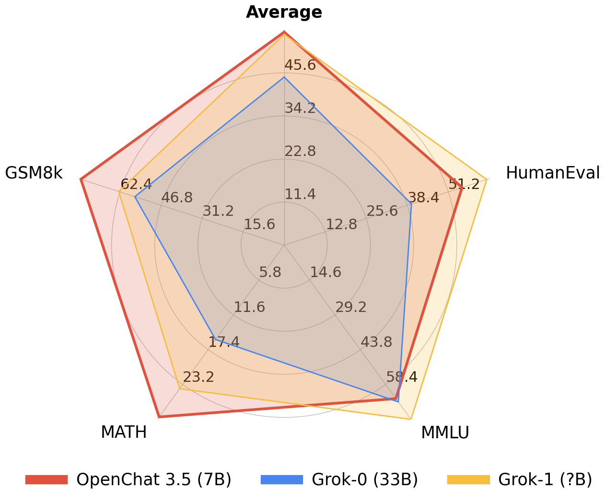

# OpenChat: Advancing Open-source Language Models with Mixed-Quality Data

<div align="center">
  
</div>

<p align="center">
  <a href="https://openchat.team">💻Online Demo</a> |
  <a href="https://huggingface.co/openchat">🤗Huggingface</a> |
  <a href="https://arxiv.org/pdf/2309.11235.pdf">📃Paper</a> |
  <a href="https://discord.gg/pQjnXvNKHY">💭Discord</a> 
  <br><br>
  <strong>🔥 First 7B model that Achieves Comparable Results with ChatGPT (March)! 🔥</strong>
  <br>
  <strong>🤖 #1 Open-source model on MT-bench scoring 7.81, outperforming 70B models 🤖</strong>
  <br>
</p>

<div align="center">
  
  
</div>

- OpenChat is an innovative library of **open-source language models**, fine-tuned with [**C-RLFT**](https://arxiv.org/pdf/2309.11235.pdf) - a strategy inspired by offline reinforcement learning.
- Our models learn from mixed-quality data without preference labels, delivering exceptional performance on par with `ChatGPT`, even with a `7B` model which can be run on a **consumer GPU (e.g. RTX 3090)**.
- Despite our simple approach, we are committed to developing a high-performance, commercially viable, open-source large language model, and we continue to make significant strides toward this vision.

[](https://zenodo.org/badge/latestdoi/645397533)

# ✨ News

- [2023/11/01] We released the [OpenChat-3.5-7B](https://huggingface.co/openchat/openchat_3.5) model, surpassing ChatGPT on various benchmarks 🔥.

- [2023/09/21] We released our paper [OpenChat: Advancing Open-source Language Models with Mixed-Quality Data](https://arxiv.org/pdf/2309.11235.pdf).

- [2023/09/03] We released the [OpenChat V3.2 SUPER]([#models](https://huggingface.co/openchat/openchat_v3.2_super)) model.

- [2023/08/04] We have launched an [Online Demo](https://openchat.team) featuring the latest version, OpenChat 3.2.

- [2023/07/30] We are thrilled to introduce the [OpenChat V3 model series](#models), based on Llama 2, and now available for free for commercial use!

- [2023/07/07] We released the [OpenChat V2 model series](#legacy-models).

- [2023/07/01] We released the [OpenChat V1 model series](#legacy-models).

# 🏷️ Benchmarks

| Model              | # Params | Average  | MT-Bench     | AGIEval  | BBH MC   | TruthfulQA    | MMLU         | HumanEval       | BBH CoT     | GSM8K        |
|--------------------|----------|----------|--------------|----------|----------|---------------|--------------|-----------------|-------------|--------------|
| OpenChat-3.5       | **7B**   | **61.6** | 7.81         | **47.4** | **47.6** | **59.1**      | 64.3         | **55.5**        | 63.5        | **77.3**     |
| ChatGPT (March)*   | ?        | 61.5     | **7.94**     | 47.1     | **47.6** | 57.7          | **67.3**     | 48.1            | **70.1**    | 74.9         |
|                    |          |          |              |          |          |               |              |                 |             |              |
| OpenHermes 2.5     | 7B       | 59.3     | 7.54         | 46.5     | 49.4     | 57.5          | 63.8         | 48.2            | 59.9        | 73.5         |
| OpenOrca Mistral   | 7B       | 52.7     | 6.86         | 42.9     | 49.4     | 45.9          | 59.3         | 38.4            | 58.1        | 59.1         |
| Zephyr-β^          | 7B       | 34.6     | 7.34         | 39.0     | 40.6     | 40.8          | 39.8         | 22.0            | 16.0        | 5.1          |
| Mistral**          | 7B       | -        | 6.84         | 38.0     | 39.0     | -             | 60.1         | 30.5            | -           | 52.2         |
| Open-source SOTA** | 13B-70B  | 61.4     | 7.71         | 41.7     | 49.7     | 62.3          | 63.7         | 73.2            | 41.4        | 82.3         |
|                    |          |          | WizardLM 70B | Orca 13B | Orca 13B | Platypus2 70B | WizardLM 70B | WizardCoder 34B | Flan-T5 11B | MetaMath 70B |

<details>
  <summary>Evaluation details</summary>
*: ChatGPT (March) results are from GPT-4 Technical Report, Chain-of-Thought Hub, and our evaluation.

^: Zephyr-β often fails to follow few-shot CoT instructions, likely because it was aligned with only chat data but not trained on few-shot data.

 **: Mistral and Open-source SOTA results are taken from reported results in instruction-tuned model papers and official repositories.

All models are evaluated in chat mode (e.g. with the respective conversation template applied). All zero-shot benchmarks follow the same setting as in the AGIEval paper and Orca paper. CoT tasks use the same configuration as Chain-of-Thought Hub, HumanEval is evaluated with EvalPlus, and MT-bench is run using FastChat. To reproduce our results, follow the instructions below.
</details>

<details>
  <summary>Reproducing benchmarks</summary>

Reasoning:

Note: Please run the following commands at the base directory of this repository.

```bash
python -m ochat.evaluation.run_eval --condition "GPT4 Correct" --model openchat/openchat_3.5
python ochat/evaluation/view_results.py
```

HumanEval:

Note: Please run the following commands at the base directory of this repository.

```bash
python -m ochat.evaluation.run_eval --condition "Code" --eval_sets coding --model openchat/openchat_3.5
python ochat/evaluation/convert_to_evalplus.py
```

Then all humaneval code samples are placed in `ochat/evaluation/evalplus_codegen`. Use the following command to evaluate an individual code sample named `samples.jsonl` using Docker as a sandbox.

```bash
docker run -v $(pwd):/app ganler/evalplus:latest --dataset humaneval --samples samples.jsonl
```

MT-Bench:

Please first launch a local API server, then download FastChat and run the following commands.

Note: Due to non-zero temperature and GPT-4 API changes over time, there might be variations in the results.

```bash
cd fastchat/llm_judge
python gen_api_answer.py --model openchat_3.5 --max-tokens 4096 --parallel 128 --openai-api-base http://localhost:18888/v1
python gen_judgment.py --model-list openchat_3.5 --parallel 8 --mode single
```

</details>

## 🎇 Comparison with [X.AI Grok](https://x.ai/)

|              | License     | # Param | Average  | MMLU | HumanEval | MATH     | GSM8k    |
|--------------|-------------|---------|----------|------|-----------|----------|----------|
| OpenChat 3.5 | Apache-2.0  | 7B      | **56.4** | 64.3 | 55.5      | **28.6** | **77.3** |
| Grok-0       | Proprietary | 33B     | 44.5     | 65.7 | 39.7      | 15.7     | 56.8     |
| Grok-1       | Proprietary | ?       | 55.8     | 73   | 63.2      | 23.9     | 62.9     |

# ⬇️ Installation
> [!NOTE]
> Need [`pytorch`](https://pytorch.org/get-started/locally/#start-locally) to run OpenChat

## pip

```bash
pip3 install ochat
```
> [!IMPORTANT]
> If you are facing package compatibility issues with pip, try the conda method below or check [this issue](https://github.com/imoneoi/openchat/issues/41)

## conda

```bash
conda create -y --name openchat python=3.11
conda activate openchat

pip3 install ochat
```

## Windows (WSL 1.x, Ubuntu-22.04)

```bash
sudo apt update
sudo apt install build-essential

sudo apt install -y curl
curl -o miniconda.sh https://repo.anaconda.com/miniconda/Miniconda3-latest-Linux-x86_64.sh
bash miniconda.sh

# Restart WSL terminal if the following conda command does not work

conda create -y --name openchat python=3.11
conda activate openchat

pip3 install ochat
```

## From source

<details>
  <summary>Installing ochat from source</summary>

```bash
git clone https://github.com/imoneoi/openchat
cd openchat

pip3 install --upgrade pip  # enable PEP 660 support
pip3 install -e .
```
</details>

# 🚀 Deploying API server

⚡ Our API server is ready for production use and compatible with the OpenAI API protocol. It is highly optimized with vLLM and can dynamically batch requests.

📎 Note: For 20 series or older GPUs that do not support `bfloat16`, add `--dtype float16` to the server args.

### For a single GPU (e.g. RTX 3090, 4090)

```bash
python -m ochat.serving.openai_api_server --model openchat/openchat_3.5
```

### For multiple GPUs (tensor parallel)

```bash
# N is the number of tensor parallel GPUs
python -m ochat.serving.openai_api_server --model openchat/openchat_3.5 --engine-use-ray --worker-use-ray --tensor-parallel-size N
```

use `-h` to see more settings
```bash
python -m ochat.serving.openai_api_server --model openchat/openchat_3.5 -h
```

<details>
  <summary>Deploy as online service</summary>

If you want to deploy the server as an online service, you can use `--api-keys sk-KEY1 sk-KEY2 ...` to specify allowed API keys and `--disable-log-requests --disable-log-stats --log-file openchat.log` for logging only to a file. For security purposes, we recommend using an [HTTPS gateway](https://fastapi.tiangolo.com/es/deployment/concepts/#security-https) in front of the server.

</details>

## Request example

Once started, the server listens at `localhost:18888` for requests and is compatible with the [OpenAI ChatCompletion API specifications](https://platform.openai.com/docs/api-reference/chat). 

```bash
curl http://localhost:18888/v1/chat/completions \
  -H "Content-Type: application/json" \
  -d '{
    "model": "openchat_3.5",
    "messages": [{"role": "user", "content": "You are a large language model named OpenChat. Write a poem to describe yourself"}]
  }'
```

### Coding Mode

```bash
curl http://localhost:18888/v1/chat/completions \
  -H "Content-Type: application/json" \
  -d '{
    "model": "openchat_3.5",
    "condition": "Code",
    "messages": [{"role": "user", "content": "Write an aesthetic TODO app using HTML5 and JS, in a single file. You should use round corners and gradients to make it more aesthetic."}]
  }'
```

</details>

# <a id="web-ui"></a> 🌐 Web UI - [OpenChat-UI](https://github.com/imoneoi/openchat-ui)

After launching the API server, OpenChat provide user interface that easy to interact with. [Click here to check Web UI](https://github.com/imoneoi/openchat-ui)

# 🤗 Inference with Transformers

> [!WARNING]
> It's recommeded to use our optimized API server for deployment. Inferencing with Transformers will be slower.

The default conversation template is shown below:

```
GPT4 Correct User: Hello<|end_of_turn|>GPT4 Correct Assistant: Hi<|end_of_turn|>GPT4 Correct User: How are you today?<|end_of_turn|>GPT4 Correct Assistant:
```

The following is coding mode template, which may improve performance on coding tasks.

```
Code User: Implement quicksort using C++<|end_of_turn|>Code Assistant:
```

# <a id="training"></a> 🛠️ Training

The OpenChat training system utilizes padding-free training and the [Multipack Sampler](https://github.com/imoneoi/multipack_sampler), achieving a **3~10x** speedup compared to the conventional padded training.

## Choose a base model

OpenChat supports Llama 2 and Mistral models. Please first choose a base model to fit your needs. Each base model has a corresponding weight repo, model type, and recommended batch size as listed below, they should be filled into `BASE_REPO`, `MODEL_TYPE`, and `BATCH_SIZE` in the following instructions.

| Base Model | Size | Weights (with EOT token)          | Model Type              | Recommended Batch Size per GPU (8xA100 80GB) |
|------------|------|-----------------------------------|-------------------------|--------------------------------------|
| Mistral    | 7B   | `imone/Mistral_7B_with_EOT_token` | `openchat_v3.2_mistral` | 83968                                |
| Llama 2    | 7B   | `imone/LLaMA2_7B_with_EOT_token`  | `openchat_v3.2`         | 83968                                |
| Llama 2    | 13B  | `imone/Llama2_13B_with_EOT_token` | `openchat_v3.2`         | 36864                                |

Note: The OpenChat conversation template requires an `<|end_of_turn|>` special token. The base model specified must include this token. Our provided weights are the original base weights with this token added. If you want to add them manually, use the `convert_llama_weights_to_hf_add_tokens.py` or `mistral_add_tokens.py` in the `scripts` directory.

## Installing DeepSpeed

First, ensure that the CUDA `nvcc` compiler is available in your environment. If it is not, install the CUDA toolkit that matches the version used by PyTorch.

Next, install DeepSpeed:

```bash
pip install deepspeed
```

### Preparing Your Data

To utilize the OpenChat trainer, prepare your SFT data into a JSON Lines format where each line corresponds to a `Conversation` object:

```python
class Message(BaseModel):
    role: str     # Must be "user" or "assistant"
    content: str  # Message content
    weight: Optional[float] = None  # Loss weight for this message. Typically 0 for user and 1 for assistant to supervise assistant's responses only


class Conversation(BaseModel):
    items: List[Message]  # All messages within the conversation
    condition: str = ""  # C-RLFT condition, can be any string or empty.
    system: str = ""  # System message for this conversation
```

For basic SFT, assign `weight` as `0` for human messages and `1` for assistant responses.

SFT example:

```json
{"items":[{"role":"user","content":"Hello","weight":0.0},{"role":"assistant","content":"Hi","weight":1.0},{"role":"user","content":"How are you today?","weight":0.0},{"role":"assistant","content":"I'm fine.","weight":1.0}],"system":""}
{"items":[{"role":"user","content":"Who are you?","weight":0.0},{"role":"assistant","content":"I'm OpenChat.","weight":1.0}],"system":"You are a helpful assistant named OpenChat."}
```

For C-RLFT, `condition` should be set as the class the conversation belongs to (e.g. `GPT3` or `GPT4`). The `weight` is assigned as `0` for human messages and `w` for assistant responses, where `w` is the weight of the class (e.g. `0.1` for `GPT3` and `1` for `GPT4`, as found in our C-RLFT paper).

C-RLFT example:

```json
{"items":[{"role":"user","content":"What is C-RLFT?","weight":0.0},{"role":"assistant","content":"C-RLFT is a method for improving open-source LLMs with mixed-quality data.","weight":1.0}],"condition":"GPT4","system":""}
{"items":[{"role":"user","content":"What is C-RLFT?","weight":0.0},{"role":"assistant","content":"I don't know.","weight":0.1}],"condition":"GPT3","system":""}
```

### Pre-tokenizing the Dataset

You'll then need to pre-tokenize the dataset using the command (please specify a filename as `PRETOKENIZED_DATA_OUTPUT_PATH` to store the pretokenized dataset):

```bash
python -m ochat.data.generate_dataset --model-type MODEL_TYPE --model-path BASE_REPO --in-files data.jsonl --out-prefix PRETOKENIZED_DATA_OUTPUT_PATH
```

### Launching the OpenChat Trainer

You can now launch the OpenChat trainer using the command below.
- 13B model requires eight `A/H100s` with 80GB VRAM
- 7B model can be trained with four `A/H100s` with 80GB VRAM or eight `A/H100s` with 40GB VRAM.

For hyperparameters, we recommend first setting the batch size to the recommended batch size. If OOM occurs, try setting it to the exact maximum that VRAM can hold and as a multiple of `2048`.
Other hyperparameters have been carefully selected as the default. Furthermore, the learning rate is automatically determined based on the [inverse square-root rule](https://arxiv.org/abs/2006.09092).

<details>

<summary>Training Commands (click to expand)</summary>

```bash
NUM_GPUS=8

deepspeed --num_gpus=$NUM_GPUS --module ochat.training_deepspeed.train \
          --model_path BASE_REPO \
          --data_prefix PRETOKENIZED_DATA_OUTPUT_PATH \
          --save_path PATH_TO_SAVE_MODEL \
          --batch_max_len BATCH_SIZE \
          --epochs 5 \
          --save_every 1 \
          --deepspeed \
          --deepspeed_config ochat/training_deepspeed/deepspeed_config.json
```

</details>

You can find checkpoints of all epochs in `PATH_TO_SAVE_MODEL`. Then you may evaluate each epoch and choose the best one.

# Limitations

## Foundation Model Limitations
Despite its advanced capabilities, OpenChat is still bound by the limitations inherent in its foundation models. These limitations may impact the model's performance in areas such as:

 - Complex reasoning
 - Mathematical and arithmetic tasks
 - Programming and coding challenges

## Hallucination of Non-existent Information
OpenChat may sometimes generate information that does not exist or is not accurate, also known as "hallucination". Users should be aware of this possibility and verify any critical information obtained  the model.

## Safety
OpenChat may sometimes generate harmful, hate speech, biased responses, or answer unsafe questions. It's crucial to apply additional AI safety measures in use cases that require safe and moderated responses.

# License

Our OpenChat 3.5 `code` and `models` are distributed under the **Apache License 2.0**.

# <a id="models"></a> Models

| Model        | Size | Context | Weights                                                     | Serving                                                                                                     |
|--------------|------|---------|-------------------------------------------------------------|-------------------------------------------------------------------------------------------------------------|
| OpenChat 3.5 | 7B   | 8192    | [Huggingface](https://huggingface.co/openchat/openchat_3.5) | `python -m ochat.serving.openai_api_server --model openchat/openchat_3.5 --engine-use-ray --worker-use-ray` |

## <a id="legacy-models"></a> Legacy Models

The following models are older versions of OpenChat and have inferior performance compared to the latest version. They will be deprecated in the next release. Please note that OpenChat V1 and V2 series are now deprecated, [please install 3.1.x for using V1 and V2 models](https://github.com/imoneoi/openchat/tree/83a683c775c77867cc45937fafdf48e8dcb68daa)

To run the models on multiple GPUs with smaller VRAM, you can enable tensor parallelization, for example, using the `--tensor-parallel-size 2` flag.

| Model        | Size | Context | Weights                                                      | Serving                                                                                                      |
|--------------|------|---------|--------------------------------------------------------------|--------------------------------------------------------------------------------------------------------------|
| OpenChat 3.2 SUPER | 13B  | 4096    | [Huggingface](https://huggingface.co/openchat/openchat_v3.2_super) | `python -m ochat.serving.openai_api_server --model openchat/openchat_v3.2_super --engine-use-ray --worker-use-ray` |

# 💌Contact

We are a student team  Tsinghua University, working on OpenChat, a project that requires additional computing power or LLMs API keys for further development. If you are interested in our project and would like to offer support, please feel free to reach out to us:

* Wang Guan [imonenext at gmail dot com]
* Cheng Sijie [csj23 at mails dot tsinghua dot edu dot cn]

We look forward to hearing  you and collaborating on this exciting project!

# Citation

```
@article{wang2023openchat,
  title={OpenChat: Advancing Open-source Language Models with Mixed-Quality Data},
  author={Wang, Guan and Cheng, Sijie and Zhan, Xianyuan and Li, Xiangang and Song, Sen and Liu, Yang},
  journal={arXiv preprint arXiv:2309.11235},
  year={2023}
}
```

# Acknowledgements

We extend our heartfelt gratitude to Alignment Lab AI, Nous Research, and Pygmalion AI for their substantial contributions to data collection and model training.

Special thanks go to Changling Liu  GPT Desk Pte. Ltd., Qiying Yu at Tsinghua University, Baochang Ma, and Hao Wan from 01.AI company for their generous provision of resources. We are also deeply grateful to Jianxiong Li and Peng Li at Tsinghua University for their insightful discussions.

Furthermore, we appreciate the developers behind the following projects for their significant contributions to our research: [Mistral](https://mistral.ai/), [Chain-of-Thought Hub](https://github.com/FranxYao/chain-of-thought-hub), [Llama 2](https://ai.meta.com/llama/), [Self-Instruct](https://arxiv.org/abs/2212.10560), [FastChat (Vicuna)](https://github.com/lm-sys/FastChat), [Alpaca](https://github.com/tatsu-lab/stanford_alpaca.git), and [StarCoder](https://github.com/bigcode-project/starcoder). Their work has been instrumental in driving our research forward.
